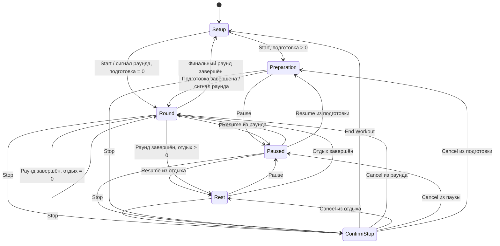

# Fight Clock: UX Flow

## 1. Цель UX

Тренер должен открыть приложение, при необходимости скорректировать точные интервалы и запустить тренировку без создания сущностей, навигации по библиотеке или подтверждения сохранения.

Основной путь:

```text
Настройки -> Start -> Подготовка (если > 0) -> Раунд -> Отдых -> ... -> Финальный раунд -> Настройки
```

## 2. Карта состояний



## 3. Экран настройки

### Содержимое

- заголовок приложения;
- выбор количества раундов `1...15`;
- выбор времени подготовки двумя колёсами Minutes и Seconds;
- выбор длительности раунда двумя колёсами Minutes и Seconds;
- выбор длительности отдыха двумя колёсами Minutes и Seconds;
- выбор предупреждения: Off, 10 sec или 30 sec;
- основная кнопка Start.

Последние значения отображаются сразу. Отдельных кнопок Save, Presets и History нет.

### Правила ввода

- секунды выбираются с шагом 5;
- недопустимые значения не показываются либо автоматически приводятся к ближайшему допустимому;
- кнопка Start доступна только для валидной конфигурации;
- VoiceOver произносит полное значение, например «Раунд, 2 минуты 30 секунд».

### Первый запуск

Показываются `3` раунда, `0:10` подготовка, `3:00` раунд, `1:00` отдых и выключенное предупреждение. Разрешение на уведомления запрашивается только после явного нажатия «Разрешить уведомления». Отказ не блокирует основной сценарий.

## 4. Активный таймер

### Общая иерархия

1. Текущий этап: Preparation, Round или Rest.
2. Максимально крупный остаток времени `M:SS`.
3. Индикатор `Round 2 of 5`.
4. Pause/Resume как основное действие.
5. Stop как визуально вторичное опасное действие.

### Portrait

```text
+-------------------------+
| ROUND                   |
|                         |
|          2:17           |
|                         |
|       Round 2 of 5      |
|                         |
|      [ Pause ]          |
|        Stop             |
+-------------------------+
```

### Landscape

```text
+------------------------------------------------+
| ROUND  2/5              2:17       [Pause] Stop |
+------------------------------------------------+
```

Landscape отдаёт основную площадь цифрам. Кнопки остаются доступны и не перекрываются системными safe areas.

### Визуальные состояния

- Preparation, Round и Rest различаются подписью и контрастной цветовой схемой; границы раунда и отдыха дополнительно различаются звуком.
- На паузе время не меняется, а надпись Paused заменяет название активного этапа или явно дополняет его.
- Цвет не используется как единственный носитель смысла.
- При смене ориентации состояние и остаток времени не сбрасываются.

## 5. Пауза

Pause срабатывает без подтверждения. Экран сохраняет исходный этап и показывает зафиксированный остаток.

Доступные действия:

- Resume — продолжить тот же этап;
- Stop — открыть подтверждение завершения.

Пауза или продолжение из Live Activity должны отражаться в открытом приложении без дополнительного действия пользователя.

## 6. Досрочное завершение

Stop открывает системное подтверждение:

- заголовок: «Завершить тренировку?» / “End workout?”;
- пояснение: текущая сессия не будет сохранена в историю, поскольку истории в MVP нет;
- Cancel;
- End Workout как destructive action.

После End Workout фоновые сигналы отменяются, Live Activity закрывается и отображается экран настройки с последними значениями.

## 7. Штатное завершение

После последней секунды финального раунда:

1. звучит сигнал завершения;
2. активная сессия и Live Activity завершаются;
3. приложение возвращается к экрану настройки без отдельного экрана результата.

Если приложение находится в фоне, пользователь получает финальный системный сигнал. При следующем открытии показывается экран настройки.

## 8. Live Activity

### Running

- Preparation, Round или Rest;
- текущий и общий номер раунда;
- системный обратный отсчёт до границы этапа;
- Pause.

### Paused

- Paused;
- исходный этап и номер раунда;
- зафиксированный остаток;
- Resume.

### Stale

После границы этапа Live Activity не пытается самостоятельно показывать следующий этап без запуска кода приложения:

- скрывает Pause/Resume;
- сообщает, что данные нужно обновить;
- предлагает открыть приложение;
- не влияет на заранее запланированные фоновые сигналы.

После открытия приложения актуальное состояние рассчитывается по временным меткам и снова передаётся в Live Activity.

### Недоступность

Если Live Activities отключены, приложение не показывает ошибку при каждом запуске. Основной таймер работает, а объяснение доступно рядом с настройкой фонового поведения или при первом обнаружении ограничения.

Live Activity без серверных push-обновлений гарантированно показывает актуальный раунд и отдых только до ближайшей границы этапа. Это системное ограничение явно отражается в stale-состоянии вместо показа неверного раунда на `0:00`.

## 9. Фоновые переходы

### Блокировка или другое приложение

- сессия продолжает идти;
- экранный UI не является источником времени;
- границы этапов сопровождаются заранее запланированными системными сигналами;
- возврат открывает актуальный этап.

### Телефонный звонок

Таймер продолжает идти. Звук границы может быть прерван системой. После звонка приложение не воспроизводит задним числом все пропущенные сигналы, а показывает актуальное состояние.

### Принудительное закрытие

Приложение не обещает выполнение собственного кода после force quit. При следующем запуске оно восстанавливает расчётное состояние по сохранённым данным. Если сессия уже закончилась, открываются настройки.

## 10. Разрешения и сообщения

### Уведомления не разрешены

Перед запуском или после отказа показывается неблокирующее объяснение:

> Разрешите уведомления, чтобы слышать сигналы при заблокированном экране. Без разрешения таймер надёжно звучит только пока приложение открыто.

Пользователь может продолжить без перехода в Settings.

### Ограничения звука

Текст не должен обещать, что сигнал прозвучит «всегда». Допустимая формулировка:

> Системные режимы без звука, Focus и активный звонок могут заглушить фоновые сигналы.

## 11. Локализация

Все пользовательские строки существуют на русском и английском. Числовой формат таймера остаётся `M:SS`. Термины:

| Русский | English |
|---|---|
| Раунд | Round |
| Отдых | Rest |
| Пауза | Pause |
| Продолжить | Resume |
| Завершить | Stop |
| Начать | Start |

## 12. UX-критерии приёмки

- Сценарий `3 раунда / 2:30 / 1:15` настраивается без текстовой клавиатуры.
- Start доступен на стартовом экране без дополнительной навигации.
- В portrait и landscape время читается с расстояния, типичного для индивидуальной тренировки.
- Пользователь всегда может определить этап без опоры только на цвет.
- Одно случайное нажатие Stop не завершает сессию.
- Пауза и Resume не изменяют номер раунда и не сбрасывают остаток.
- После штатного и досрочного завершения настройки сохраняются.
