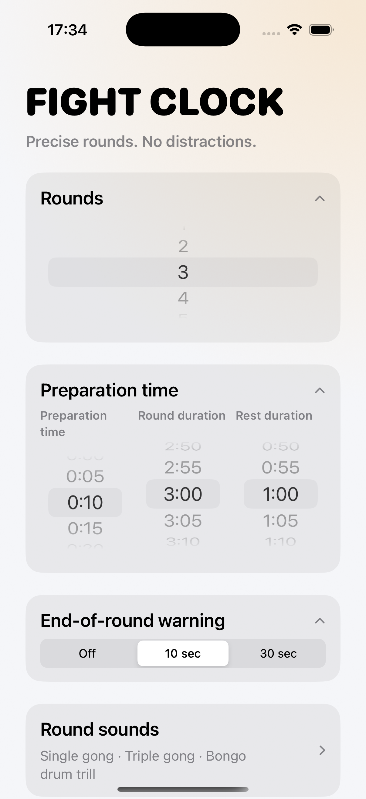

# Fight Clock: Hypothesis Review

## Triple Duration Picker

- Дата: 19 августа 2026
- Статус: Отклонено после визуального ревью прототипа
- Кто принял решение: product/design review в репозитории

## Гипотеза

Заменить отдельные контролы длительности `Preparation`, `Round` и `Rest` на одну компактную карточку с тремя wheel picker'ами, расположенными рядом.

Ожидаемая польза:

- уменьшить вертикальную высоту setup-экрана;
- сделать основной блок настройки времени более компактным.

## Прототип

Скриншот проверенного варианта:

## Результат

Решение: отклонить это UI-направление.

Причины отклонения:

- визуально блок выглядит заметно слабее остального setup-экрана;
- три соседних wheel picker'а перегружают одну карточку и делают её тяжёлой;
- длинные подписи вроде `Preparation time`, `Round duration` и `Rest duration` создают шум ещё до первого взаимодействия;
- контроль ослабляет визуальную иерархию: вместо одной чёткой редактируемой настройки на карточку пользователь получает плотный кластер конкурирующих значений;
- компактность улучшается, но читаемость и общее ощущение качества заметно ухудшаются.

## Что здесь факт, а что интерпретация

Подтверждено прототипом и скриншотом:

- трёхколоночная компоновка технически помещается;
- подписи и колёса конкурируют за место внутри одной карточки;
- итоговый блок плотнее и сложнее для быстрого сканирования, чем текущие раздельные контролы.

Интерпретация:

- формулировка «выглядит плохо» — это дизайнерское суждение, а не измеримая usability-метрика;
- текущее отклонение основано на визуальном качестве и ясности, а не на таймированном usability-тесте.

## Следующий шаг

- оставить раздельные контролы для setup-длительностей;
- если к уплотнению вернутся позже, искать альтернативы, которые не держат три wheel picker'а видимыми одновременно.
