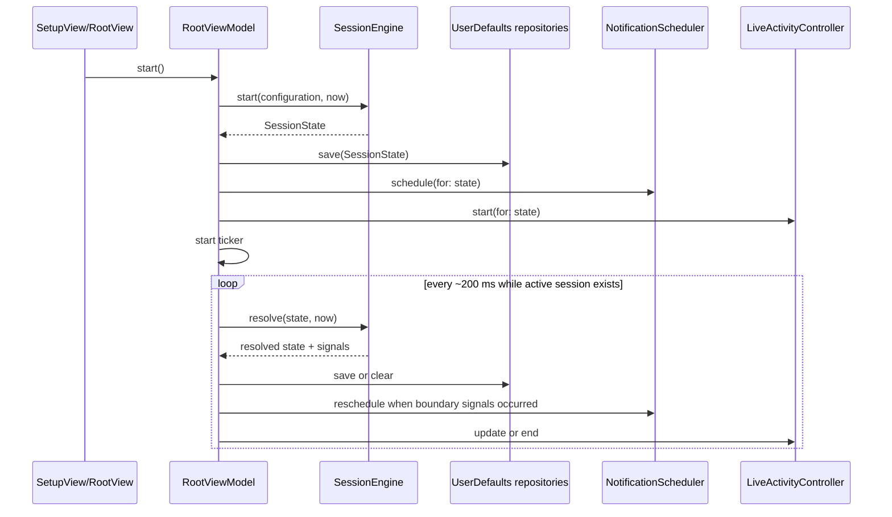

# Fight Clock: Technical Architecture

## Назначение

Документ описывает текущее устройство iOS-приложения Fight Clock для разработчиков и ревьюеров. Источник фактов: Swift-код, XcodeGen/SwiftGen-конфигурация и существующая документация на 19 августа 2026 года.

Продуктовое имя в интерфейсе — **Fight Clock**. Техническое имя проекта — `BoxingTimer`; targets и Swift-модули называются `Main` и `LiveActivity`.

## Границы

В документ входят слои приложения, поток состояния таймера, хранение, уведомления, Live Activity, звук и генерация проекта. Не входят история продуктовых решений, детали отдельных тестов и планы будущих функций.

## Проверенные источники

- `Main/App/AppDependencies.swift`, `Main/App/BoxingTimerApp.swift`;
- `Main/Core/Session/*`;
- `Main/Model/Domain/*`;
- `Main/Flows/Setup/*`, `Main/Flows/Root/*`, `Main/Flows/Active/*`;
- `Main/Infrastructure/Persistence/*`, `Main/Infrastructure/Notifications/*`, `Main/Infrastructure/Audio/*`, `Main/Infrastructure/LiveActivity/*`, `Main/Infrastructure/System/*`;
- `LiveActivity/*`;
- `Main/Resources/Configuration/*`, `Main/Resources/Localization/*`, `Main/Resources/Audio/*`;
- `scripts/generate.sh`, `scripts/xcodegen/*`, `scripts/swiftgen/*`, `scripts/fastlane/*`.

Тесты использовались только как дополнительный сигнал контракта, без документирования отдельных test cases.

## Слои

```text
+----------------------+      +----------------------+
| Main/App/            | ---> | Main/Flows/          |
| entry point, DI      |      | SwiftUI screens, VM  |
+----------------------+      +----------+-----------+
                                         |
                                         v
+----------------------+      +----------------------+
| Main/Infrastructure/ | <--- | Main/Core/          |
| persistence, audio,  |      | session engine,      |
| notifications, live  |      | boundary planning    |
| activity, system     |      +----------+-----------+
+----------------------+                 |
          ^                              v
          |                   +----------------------+
          +------------------>| Main/Model/          |
                              | domain state/types   |
                              +----------------------+
```

`AppDependencies` собирает production-зависимости для `RootViewModel`: репозитории UserDefaults, планировщик уведомлений, foreground-плеер, контроллер Live Activity, контроллер idle timer и системный поставщик даты.

## Основные компоненты

| Компонент | Ответственность |
|---|---|
| `RootViewModel` | Главный координатор UI-состояния, запуска, паузы, остановки, синхронизации, звуков, уведомлений и Live Activity. |
| `SessionEngine` | Чистая доменная логика запуска, переходов между фазами, паузы, продолжения и расчёта остатка. |
| `SessionBoundaryPlanner` | Построение будущих границ сессии для локальных уведомлений. |
| `TimerConfiguration` | Валидируемый снимок настроек: раунды, длительности, предупреждение и выбранные звуки. |
| `SessionState` | Сохранённое состояние активной сессии с абсолютной границей текущего этапа. |
| `NotificationScheduler` | Запрос разрешений, планирование и отмена локальных уведомлений по будущим границам. |
| `ForegroundSignalPlayer` | Воспроизведение foreground-сигналов и preview выбранных звуков через `AVAudioPlayer`. |
| `LiveActivityController` | Создание, обновление и завершение ActivityKit Live Activity. |

## Поток сессии



Состояние таймера не выводится из количества UI-тиков. Для running-фазы источником истины является `phaseEndDate`; для паузы — `pausedRemaining`.

## Конфигурация и валидация

`TimerConfiguration.defaultValue` задаёт:

- `roundCount = 3`;
- `roundDuration = 180`;
- `restDuration = 60`;
- `preparationDuration = 10`;
- `roundWarning = .tenSeconds`;
- `soundConfiguration = .defaultValue`.

Валидная конфигурация ограничена диапазонами:

- раунды: `1...15`;
- раунд: `10...900` секунд;
- отдых: `0...300` секунд;
- подготовка: `0...300` секунд;
- все длительности кратны 5 секундам.

Пока сессия активна, `RootViewModel.update(...)` не меняет конфигурацию.

Setup-экран не даёт пользователю ввести произвольное число с клавиатуры: длительности выбираются через `DurationPicker`, где минуты и секунды строятся из допустимого диапазона, а секунды идут с шагом 5.

## Переходы и сигналы

`SessionEngine.resolve(_:at:)` последовательно догоняет состояние до текущего времени. Если приложение пропустило несколько границ, engine может вернуть несколько сигналов, но foreground-воспроизведение в `RootViewModel` выбирает только релевантный сигнал рядом с недавней границей и не проигрывает старые переходы задним числом.

Предупреждение конца раунда создаётся только когда:

- текущая фаза — `round`;
- предупреждение не `disabled`;
- длительность раунда больше выбранного предупреждения;
- предупреждение ещё не воспроизводилось в текущем раунде.

## Хранение

Конфигурация, активная сессия и состояние раскрытия setup-карточек сохраняются в `SharedDefaults.store` через JSON-кодирование в UserDefaults. `SharedDefaults.store` использует App Group `group.ru.kostyuchenko.fightclock`, поэтому Live Activity intents могут читать и обновлять активную сессию из extension.

При невалидной или нечитаемой сохранённой конфигурации используется `TimerConfiguration.defaultValue`. Завершённая сессия очищается, история тренировок в текущей версии не хранится.

## Уведомления

`NotificationScheduler` планирует локальные уведомления для будущих границ, которые возвращает `SessionBoundaryPlanner`. Перед новым планированием уведомления текущей сессии отменяются по идентификаторам вида `boxing-timer.boundary.<sessionID>.<notificationRevision>.<index>`. Диапазон индексов `0...44` покрывает максимальную конфигурацию MVP: подготовку, 15 предупреждений, 14 переходов к отдыху, 14 стартов следующего раунда и финальное завершение.

Планирование выполняется только при разрешении `.allowed`. Отказ в разрешении не блокирует активную сессию, но фоновые сигналы через системные уведомления не создаются.

## Live Activity

Live Activity содержит только данные отображения: фазу, текущий и общий номер раунда, `phaseEndDate`, `pausedRemaining` и флаг паузы. `staleDate` равен `phaseEndDate`, поэтому без выполнения кода приложения системное отображение не обещает автономно переключать этапы после ближайшей границы.

`PauseSessionIntent` и `ResumeSessionIntent` выполняются в extension: они читают `SessionState` из общего UserDefaults, пересчитывают состояние через `SessionEngine`, отменяют или заново планируют уведомления и обновляют ActivityKit-состояние. Команды Stop в Live Activity нет.

## Звук

Foreground-сигналы и preview используют встроенные ресурсы `BundledTimerSound`. По умолчанию:

- начало раунда: `singleGong`;
- переход к отдыху и завершение тренировки: `tripleGong`;
- предупреждение: `bongoDrumTrill`.

В модели конфигурации есть три независимые роли звука: `roundStartSound`, `roundTransitionSound` и `warningSound`. Начало отдыха и завершение тренировки используют общий `roundTransitionSound`, отдельного звука "финал тренировки" в текущей реализации нет.

Для foreground-воспроизведения и системных уведомлений используется точный выбранный WAV-ресурс.

`ForegroundSignalPlayer` использует категорию AVAudioSession `.playback` с `.duckOthers` и деактивирует сессию после завершения воспроизведения.

## Инварианты

- `SessionEngine` не имеет зависимостей от UI, UserDefaults, уведомлений или ActivityKit.
- Запуск сессии фиксирует снимок конфигурации; изменения настроек применяются только до запуска.
- Пауза отменяет будущие уведомления и удаляет `phaseEndDate`; продолжение создаёт новую границу от текущего времени.
- Штатное и досрочное завершение очищают сохранённую активную сессию, отменяют уведомления, включают обратно системную автоблокировку и завершают Live Activity.
- Foreground-звук завершения при штатном окончании проигрывается только если приложение активно и граница была недавней.

## Ограничения

- iOS-режимы Silent Mode, Focus, звонки и аудиомаршруты могут помешать слышимости фоновых сигналов.
- После force quit нельзя рассчитывать на выполнение кода приложения; восстановление происходит при следующем запуске.
- Live Activity без push-обновлений не является фоновым процессом таймера.
- В репозитории используются встроенные аудиоресурсы; часть файлов названа как placeholder.
- App Store metadata, privacy text и release notes не обнаружены в репозитории как готовые артефакты.

## Связанные документы

- [Product Requirements Document](../product/prd.md)
- [UX Flow](../ux/flow.md)
- [Локальные скрипты и доставка](scripts.md)
